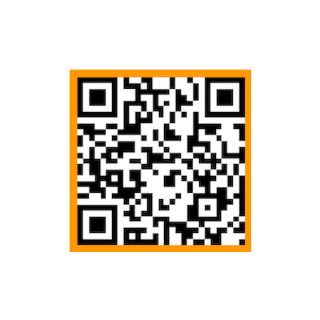
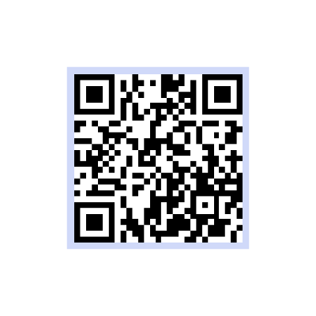
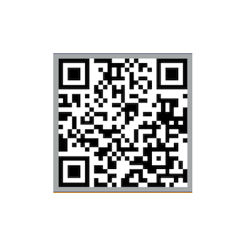

# MSc-notes
This folder contains some notes made during the **MSc in Engineering in Computer Science** at *La Sapienza* University of Rome. Feel free to contact me if you find errors or you want to add missing stuffs!

---
All the material is **free** to use, but please do not try to sell it.

As many other students do, here some links and qr if you want to buy me a beer. Thanks!

[PayPal](paypal.me/MIvagnes) | **Bitcoin**
:--- | :---
 |   
**Ethereum** | **Litecoin**
 | 
